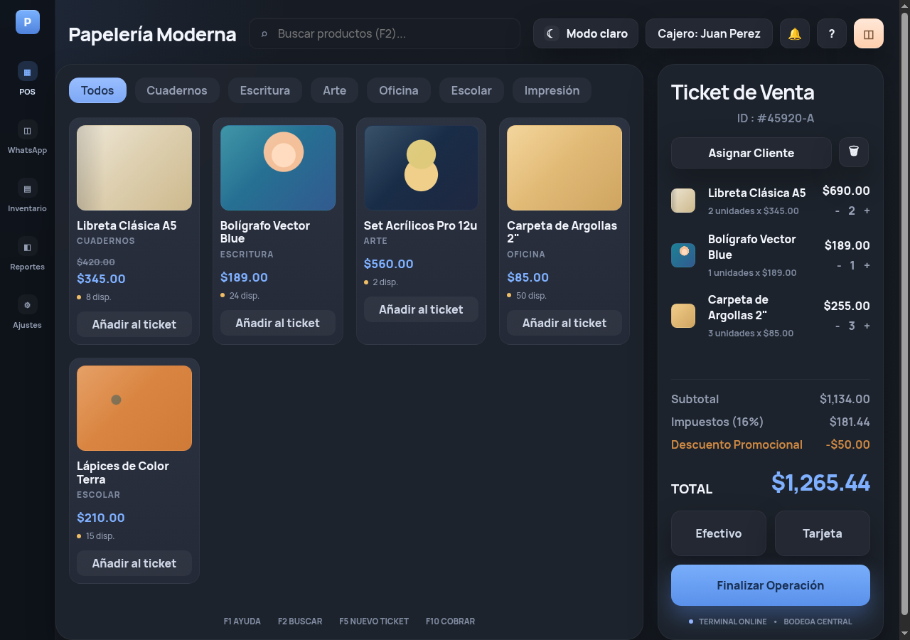

# Stationery POS Frontend Demo — First Iteration

> **Timeline:** This is the first iteration of the POS concept.  
> `papeleria-pos-demo` *(this repo — static mockup)* → [`frank-launchpad`](https://github.com/FranklinSRomero/frank-launchpad) *(SvelteKit + NestJS + chatbot)* → [`frank-pos`](https://github.com/FranklinSRomero/frank-pos) *(richer API + UI prototypes)*

A static Point of Sale (POS) frontend demo for a stationery store. Open it locally to explore a polished catalog-and-ticket interface with no installation beyond Python.

[](https://franklinsromero.github.io/papeleria-pos-demo/)

> **Demo only:** product and ticket data are hardcoded; there is no backend, persistence, or real checkout flow.

## Live Demo

Open the deployed site: [https://franklinsromero.github.io/papeleria-pos-demo/](https://franklinsromero.github.io/papeleria-pos-demo/).

> **GitHub Pages setup:** after the first deployment workflow run, go to **Settings → Pages** and set **Source** to **GitHub Actions** if Pages is not already enabled.

## Quick path

1. Start the local server:

   ```bash
   python3 server.py
   ```

2. Open [http://127.0.0.1:8000](http://127.0.0.1:8000).
3. Browse the catalog or switch between dark and light themes.

## Interface



## What you can recognize at a glance

- [x] Product catalog with categories, SKUs, prices, and stock indicators
- [x] Pre-populated sales ticket with subtotal, 16% tax, discount, and total
- [x] Cash and card payment controls
- [x] Dark/light theme toggle persisted in local storage
- [x] Responsive layout for desktop and narrower screens
- [x] Visual references for POS keyboard shortcuts

## Details

| Topic | Choice |
| --- | --- |
| UI | Vanilla HTML5, CSS3, and JavaScript |
| Local server | Python `ThreadingHTTPServer` on `127.0.0.1:8000` |
| Currency display | Mexican pesos (`es-MX` / `MXN`) |
| Data source | In-memory arrays in `app.js` |
| Theme preference | Browser `localStorage` |

<details>
<summary><strong>Project structure</strong></summary>

| File | Purpose |
| --- | --- |
| `index.html` | POS page structure |
| `styles.css` | Layout, responsive styles, and theme variables |
| `app.js` | Hardcoded catalog/ticket rendering and theme toggle |
| `server.py` | Minimal local development server |

</details>

## Known limits

- Data is hardcoded and resets on reload.
- There is no backend, database, authentication, inventory synchronization, or payment integration.
- The displayed keyboard shortcuts are visual references; they do not have keyboard event handlers.

## Next step

Use this as a visual frontend reference, or connect the catalog and ticket state to a real POS API.
